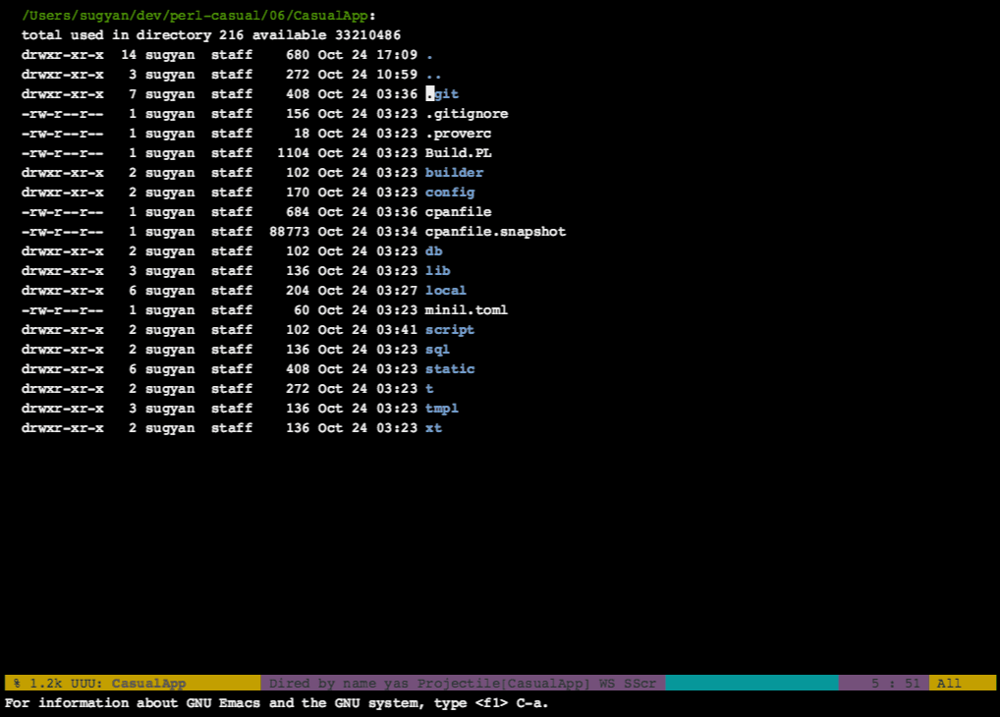
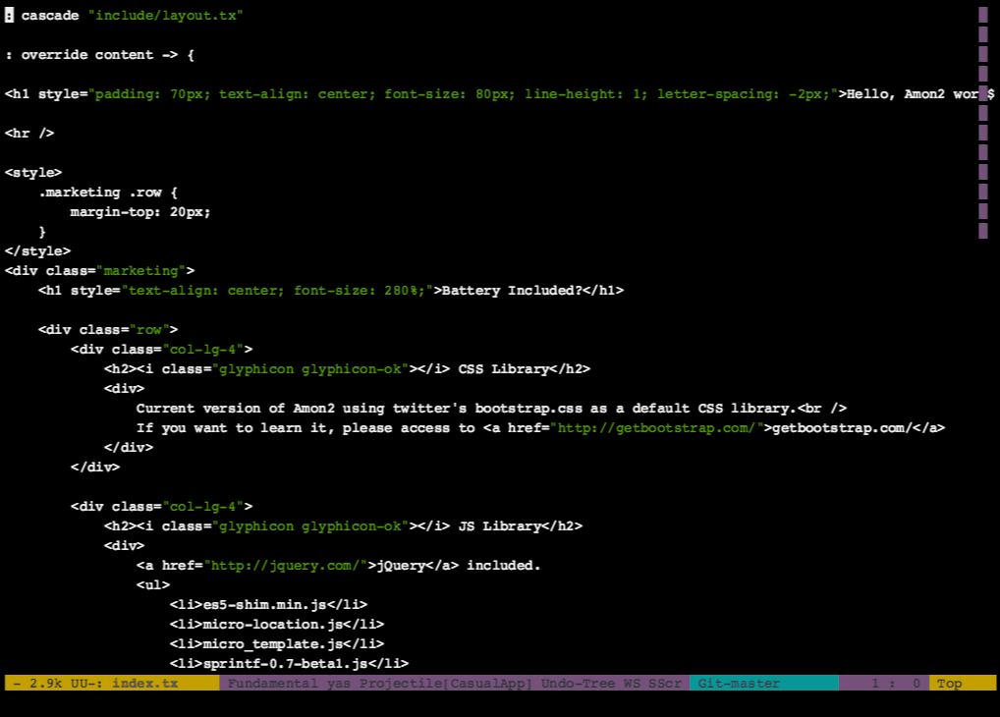
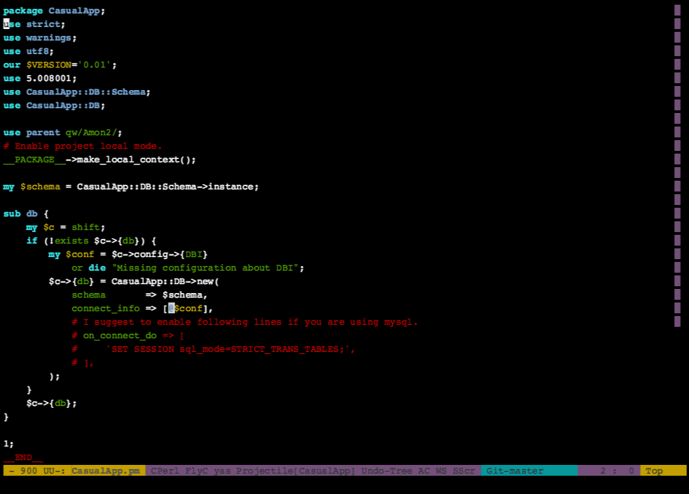
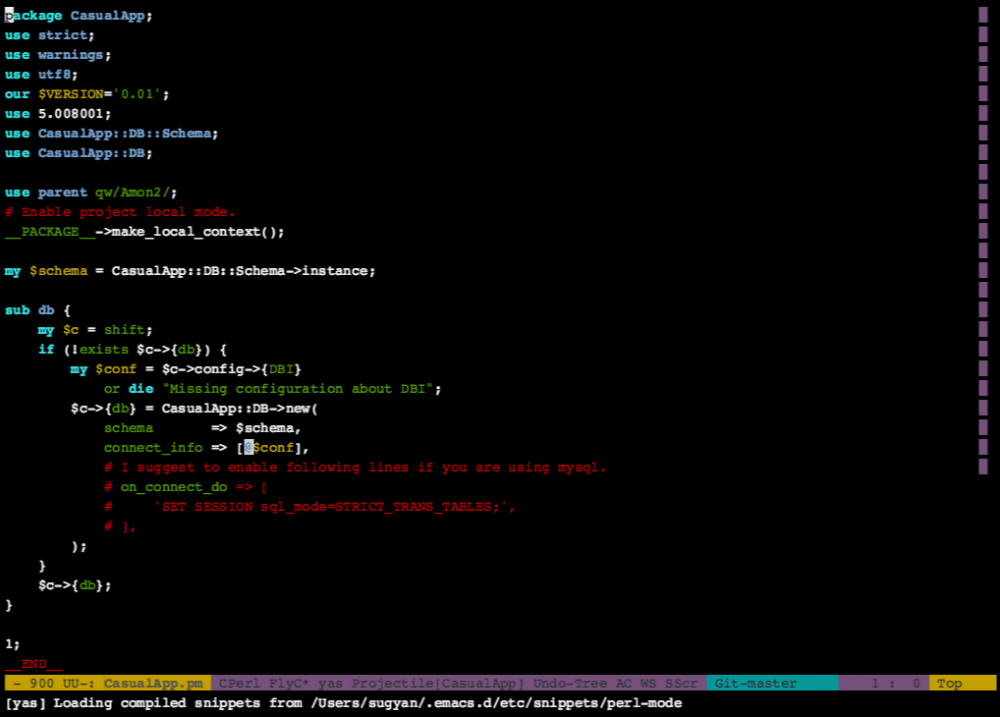

# EmacsでPerl #

PerlCasual #06 - Oct. 24, 2014

@sugyan

---

## 自己紹介 ##

- ID:sugyan (すぎゃーん)

- ドルヲタ

- ENLIGHTENED A9

---

## Emacs ##

24.4 released (Oct. 20, 2014)

---

自分がEmacsでPerlを書く際に使っているもの

---

## helm ##

- 旧: anything

- インクリメンタルに絞り込みを行うインタフェース

- unite.vim, peco, ...

---

### よく使っているもの ###

- ファイル選択・バッファ切り替え

 - helm-find-file

 - helm-projectile

 - helm-mini

- 検索・編集

 - helm-occur

 - helm-ag

 - helm-show-kill-ring

---

#### DEMO ####

---

### ファイル選択・バッファ切り替え ###

- ディレクトリ下のファイル一覧から選択

- プロジェクト下のファイル一覧から選択

- 開いているバッファから選択

- 最近開いたファイル一覧から選択

---

### 検索・編集 ###

- バッファ内検索

- ディレクトリ内検索

- `kill-ring`からのyank内容選択

---

#### DEMO ####

---

## Perlのための設定 ##

- cperl-mode

- helm-perldoc

- flycheck-mode

---

### cperl-mode ###

インデントとか良い感じに設定

    (defalias 'perl-mode 'cperl-mode)

    (custom-set-variables
     '(cperl-indent-parens-as-block t)
     '(cperl-close-paren-offset     -4)
     '(cperl-indent-subs-specially  nil))

    (with-eval-after-load "cperl-mode"
      (eval
       '(progn
          (cperl-set-style "PerlStyle"))))

---

### helm-perldoc ###

モジュールのドキュメントを探す

    ;; (package-install 'helm-perldoc)
&nbsp;

    (with-eval-after-load "cperl-mode"
      (eval
       '(progn
          (helm-perldoc:setup)
          (define-key cperl-mode-map (kbd "C-c d") 'helm-perldoc))))

    (autoload 'helm-perldoc:carton-setup "helm-perldoc" nil t)

    (defun my-cperl-mode-hook ()
      (helm-perldoc:carton-setup))
    (add-hook 'cperl-mode-hook 'my-cperl-mode-hook)

---

#### DEMO ####

---

https://github.com/sugyan/dotfiles

---

## おまけ ##

- undo-tree

- shell-pop

- helm-etags-select

- yasnippet

---

#### undo-tree ####

---

#### shell-pop ####

